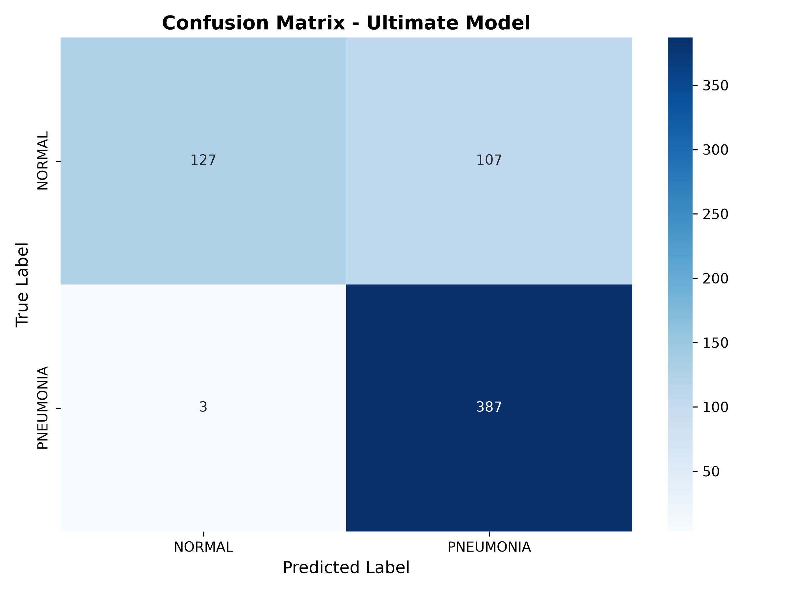
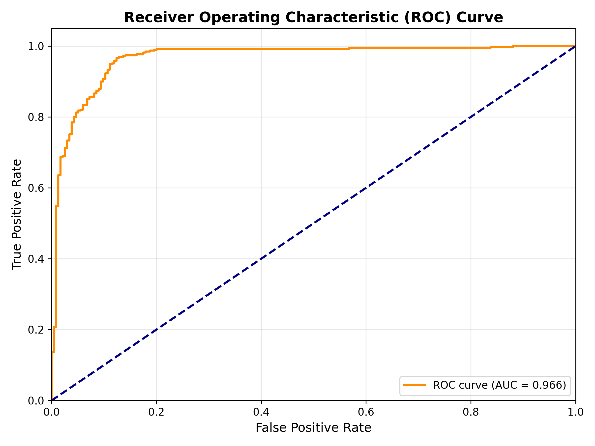
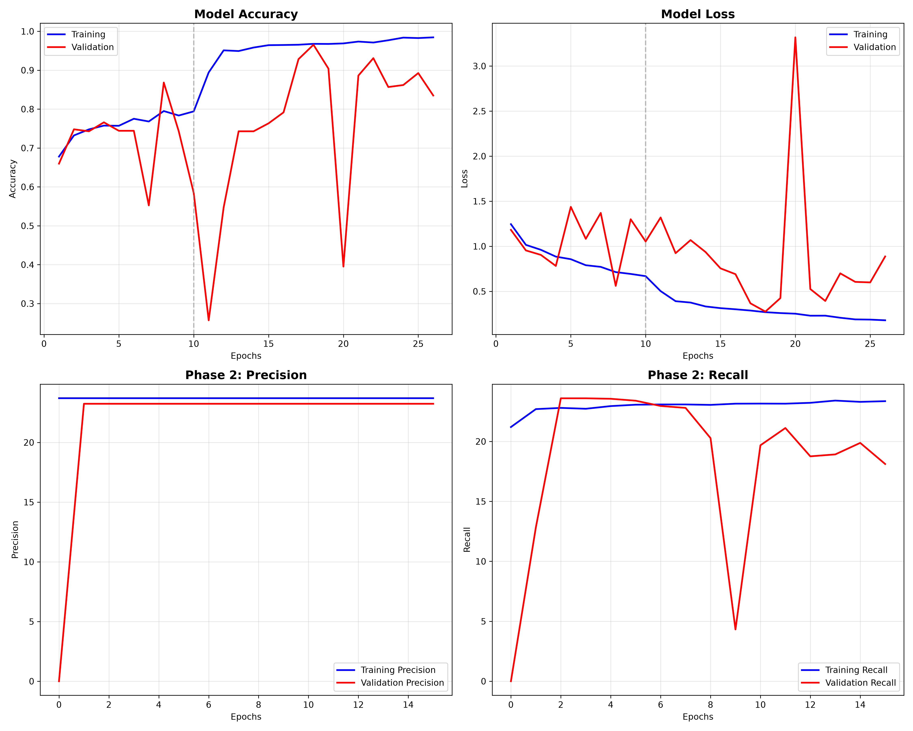

# 🫁 AI Pneumonia Detection from Chest X-Rays

A deep learning system for detecting **pneumonia from chest X-ray images** using a ResNet50-based convolutional neural network and a Streamlit web application.

> ⚠️ **Medical Disclaimer:** This project is intended for educational and research purposes only. It is not a medical diagnostic device and should not be used for clinical decision-making.

---

## 🎯 Project Overview

The system performs binary classification of chest X-ray images into:

- 🟢 **NORMAL**
- 🔴 **PNEUMONIA**

The latest version uses **ResNet50** with 224×224 input images and a two-phase training strategy.

The project includes model training, GPU acceleration, evaluation, visualization, and an interactive Streamlit interface for predictions.

---

## 🧠 Model Configuration

| Parameter | Value |
|---|---|
| Architecture | ResNet50 |
| Input Image Size | 224 × 224 |
| Training Strategy | Two-phase training |
| Phase 1 Epochs | 10 |
| Phase 2 Epochs | 20 |
| Batch Size | 32 |
| Training Images | 5,218 |
| Test Images | 624 |

---

## 📊 Final Model Performance

The final model was evaluated on a held-out test set containing **624 chest X-ray images**.

| Metric | Score |
|---|---:|
| Accuracy | **82.37%** |
| Precision | **78.34%** |
| Recall / Sensitivity | **99.23%** |
| F1-Score | **87.56%** |
| Specificity | **54.27%** |
| AUC-ROC | **96.62%** |

### Confusion Matrix

| | Predicted Normal | Predicted Pneumonia |
|---|---:|---:|
| **Actual Normal** | 127 | 107 |
| **Actual Pneumonia** | 3 | 387 |

The model achieved **99.23% sensitivity**, detecting almost all pneumonia cases in the test set.

However, the **54.27% specificity** indicates that the model also produces a significant number of false positives. This limitation is important when interpreting the results.

---

## 📈 Evaluation Visualizations

### Confusion Matrix



### ROC Curve



### Training History



---

## 🏗️ Project Structure

```text
medical_image_analysis/
│
├── app_enhanced.py
├── app_fixed.py
├── ultimate_model.py
├── training_224_fixed.py
├── real_accuracy.py
├── gpu_test.py
│
├── class_indices.json
├── training_results.json
│
├── confusion_matrix_ultimate.png
├── roc_curve_ultimate.png
├── ultimate_training_history.png
│
├── requirements.txt
└── README.md

| File                            | Description                                |
| ------------------------------- | ------------------------------------------ |
| `app_enhanced.py`               | Streamlit web application                  |
| `app_fixed.py`                  | Alternative Streamlit application          |
| `ultimate_model.py`             | Final training and evaluation pipeline     |
| `training_224_fixed.py`         | 224×224 training pipeline                  |
| `real_accuracy.py`              | Model evaluation utility                   |
| `gpu_test.py`                   | GPU/CUDA environment test                  |
| `class_indices.json`            | Class label mapping                        |
| `training_results.json`         | Final model metrics and evaluation results |
| `confusion_matrix_ultimate.png` | Confusion matrix visualization             |
| `roc_curve_ultimate.png`        | ROC-AUC visualization                      |
| `ultimate_training_history.png` | Training/validation history                |
| `requirements.txt`              | Python dependencies                        |


